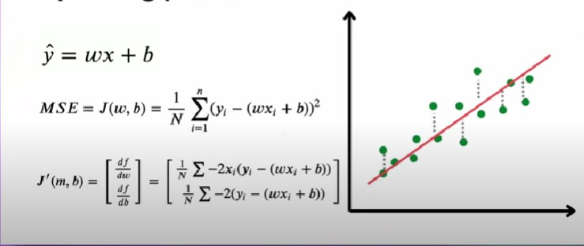
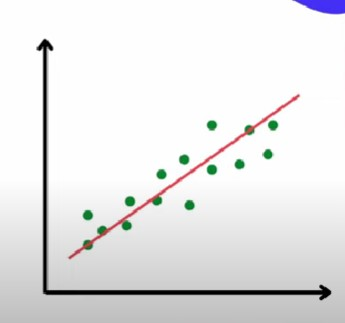
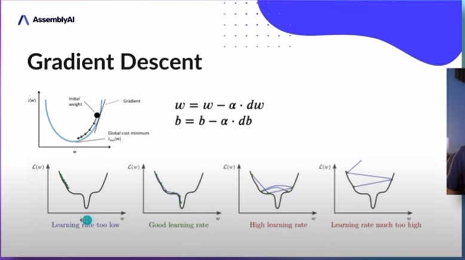

# Linear Regression

## Formulas

### Estimation
$$\hat{y}=\omega{x}+b$$

### Calculating Error
$$MSE = J(\omega, b) = \frac{1}{N}\sum_{i=1}^{n}{(y_i-(\omega x_i + b))}^{2}$$

### Updating parameters

### Gradient Descent

## Steps
#### Training
- Initialize weight as zero
- Initialize bias as zero

#### Given a data point:
- Predict result using $\hat{y}=\omega{x}+b$
- Calculate error
- Use gradient descent to figure out new weight and bias values
- Repeat n times

### Testing  
#####Given a data point:
- Put in the values from the data point into the equation $\hat{y}=\omega{x}+b$